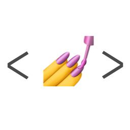

  

 

<h2 align="center">👋 안녕하세요, 프론트엔드 개발자 여찬규입니다.</h2>

  사용자 경험과 인터페이스 개선에 중점을 두고 끊임없이 배우고 성장하는 웹 프론트엔드 개발자입니다
   
  디자인과 개발 사이에서 최적의 균형을 찾는 데 열정을 가지고 있습니다

  
  
  

 

<h3 align="center">💻 Languages, Skills & Tools</h3>

  <h4>Core Technologies</h4>
  
  &nbsp;
  
  &nbsp;
  
  &nbsp;
  
  &nbsp;
  

  <h4>Frameworks & Libraries</h4>
  
  &nbsp;
  
  &nbsp;
  
  &nbsp;
  
  &nbsp;
  
  &nbsp;
  
  &nbsp;
  
  &nbsp;
  

  <h4>Tools & Platforms</h4>
  
  &nbsp;
  
  &nbsp;
  
  &nbsp;
  
  &nbsp;
  
  &nbsp;
  
  &nbsp;
  

 
 

<h3 align="center">💻 Dev Blog Latest Articles</h2>

<table align="center">
  <tr>
    <td align="center" width="280">
      <a href="https://chan9yu.dev/badge/recent/0">
        <picture>
          <source media="(prefers-color-scheme: dark)" srcset="https://chan9yu.dev/badge/recent/0/dark">
          
        </picture>
      </a>
    </td>
    <td align="center" width="280">
      <a href="https://chan9yu.dev/badge/recent/1">
        <picture>
          <source media="(prefers-color-scheme: dark)" srcset="https://chan9yu.dev/badge/recent/1/dark">
          
        </picture>
      </a>
    </td>
    <td align="center" width="280">
      <a href="https://chan9yu.dev/badge/recent/2">
        <picture>
          <source media="(prefers-color-scheme: dark)" srcset="https://chan9yu.dev/badge/recent/2/dark">
          
        </picture>
      </a>
    </td>
  </tr>
  <tr>
    <td align="center" width="280">
      <a href="https://chan9yu.dev/badge/recent/3">
        <picture>
          <source media="(prefers-color-scheme: dark)" srcset="https://chan9yu.dev/badge/recent/3/dark">
          
        </picture>
      </a>
    </td>
    <td align="center" width="280">
      <a href="https://chan9yu.dev/badge/recent/4">
        <picture>
          <source media="(prefers-color-scheme: dark)" srcset="https://chan9yu.dev/badge/recent/4/dark">
          
        </picture>
      </a>
    </td>
    <td align="center" width="280">
      <a href="https://chan9yu.dev/badge/recent/5">
        <picture>
          <source media="(prefers-color-scheme: dark)" srcset="https://chan9yu.dev/badge/recent/5/dark">
          
        </picture>
      </a>
    </td>
  </tr>
</table>
