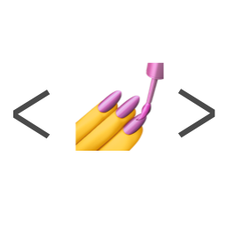

  

 

<h2 align="center">👋 안녕하세요, 프론트엔드 개발자 여찬규입니다.</h2>

  사용자 경험과 인터페이스 개선에 중점을 두고 끊임없이 배우고 성장하는 웹 프론트엔드 개발자입니다.
   
  디자인과 개발 사이에서 최적의 균형을 찾는 데 열정을 가지고 있습니다.

  

  
  
  

 

  <picture>
    <source media="(prefers-color-scheme: dark)" srcset="https://github-readme-stats.vercel.app/api?username=chan9yu&show_icons=true&theme=radical&include_all_commits=true&count_private=true&hide_border=true&bg_color=0D1117&title_color=6C5CE7&text_color=ffffff&icon_color=6C5CE7">
    
  </picture>
  <picture>
    <source media="(prefers-color-scheme: dark)" srcset="https://github-readme-stats.vercel.app/api/top-langs/?username=chan9yu&layout=compact&langs_count=8&theme=radical&hide_border=true&bg_color=0D1117&title_color=6C5CE7&text_color=ffffff">
    
  </picture>

  <picture>
    <source media="(prefers-color-scheme: dark)" srcset="https://github-readme-streak-stats.herokuapp.com/?user=chan9yu&theme=radical&hide_border=true&background=0D1117&stroke=6C5CE7&ring=6C5CE7&fire=6C5CE7&currStreakLabel=ffffff">
    
  </picture>

 

  

 

<h3 align="center">💻 Languages, Skills & Tools</h3>

  <h4>Core Technologies</h4>
  
  &nbsp;
  
  &nbsp;
  
  &nbsp;
  
  &nbsp;
  

  <h4>Frameworks & Libraries</h4>
  
  &nbsp;
  
  &nbsp;
  
  &nbsp;
  
  &nbsp;
  
  &nbsp;
  
  &nbsp;
  
  &nbsp;
  

  <h4>Tools & Platforms</h4>
  
  &nbsp;
  
  &nbsp;
  
  &nbsp;
  
  &nbsp;
  
  &nbsp;
  
  &nbsp;
  

